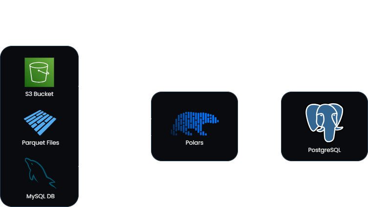

# **Multiple Source ETL**

This is a Data Engineering project that extracts data from various sources: **MySQL, Amazon S3, CSV and PARQUET** files, using Python, and Polars.

[Polars](https://pola.rs/) is a powerful open-source library for **data manipulation** in Python. Known for being one of the fastest data processing solutions on a single machine. Compared to **pandas**, it can achieve more than **30x performance gains**. Since Polars can effectively handle 10 - 100 GBs of data with one GPU, I decided it was a great opportunity to implement it in my project, with *no need of using Spark*.



---

## Data Generation

I didn't want to use another Kaggle dataset, so I generated them myself with [Faker](https://faker.readthedocs.io/en/master/), a Python library for generating fake data massively in [multiple languages](https://v6.fakerjs.dev/api/localization.html) (+60).

You can modify the scripts to define how many rows (n) and columns the datasets will have.

```python
createEmployee(n)
createCustomer(n)
createProduct(n)
createOrder(n, customers, products)
```

---

### Project Structure

```
├── multiple_source_etl/
│
├── data/
│   ├── bronze_layer/           - Raw Data (input)
│   ├── silver_layer/           - Data Transformation in same format
│   └── gold_layer/             - Clean and Processed Data 
│
│
├── ETL/                        - Extract, Transform and Load scripts
│   ├── Extract.ipynb
│   ├── Load.ipynb
│   └── Transform.ipynb
│
│
├── scripts/
│   ├── Generate 2023 Data.ipynb
│   ├── Generate 2024 Data.ipynb
│   └── Generate 2025 Data.ipynb
│
│
├── .env 			              - (Ignored with .gitignore)
├── README.md
├── LICENSE
├── requirements.txt            - Project dependencies
```

---

# Steps

### Virtual Environment

---

1. **Create a virtual environment**
   ```bash
   python -m venv 
   ```
2. **Activate it**
   ```bash
   .\<virtual-environment-name>\Scripts\Activate.ps1
   ```
3. **Clone repo**
   ```
   git clone https://github.com/fran-cornachione/multiple_source_ETL.git 
   ```
4. **Install requirements**
   ```
   pip install -r requirements.txt
   ```

> This will install all the necessary libraries:

- **pandas**
- **polars:** Data manipulation tool
- **sqlalchemy:** I used the `create_engine` function to connect with MySQL and Postgres.
- **boto3:** AWS S3 SDK (I used it to extract data from S3)
- **deltalake:** (necessary to read and write Delta files with Polars)
- **dotenv:** (necessary to hide credentials).
- **abdc-driver-manager**
- **abdc-driver-postgresql:** Used it to load data into PostgreSQL

---

### AWS

* AWS --> Users --> Create User
* **Username:** Insert any name (e.g: `boto3-user`)
* **Permissions:** Select "Attach policies directly"
* Select `AmazonS3FullAccess`
* Click on the user you just created
* Select " **Create Access key** "
* Select " **Application running outside AWS** "

---

Create a `.env` file and add the following information:

```bash
AWS_ACCESS_KEY_ID=
AWS_SECRET_ACCESS_KEY=
AWS_BUCKET_NAME=
MYSQL_USER=
MYSQL_PASSWORD=
MYSQL_DATABASE=
POSTGRES_USER=
POSTGRES_PASSWORD=
POSTGRES_DATABASE=
```

- Run all scripts
